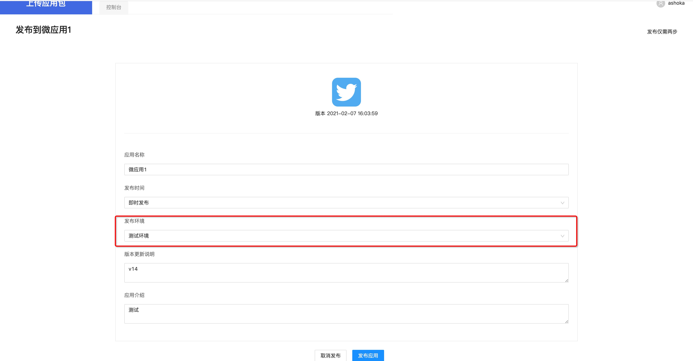
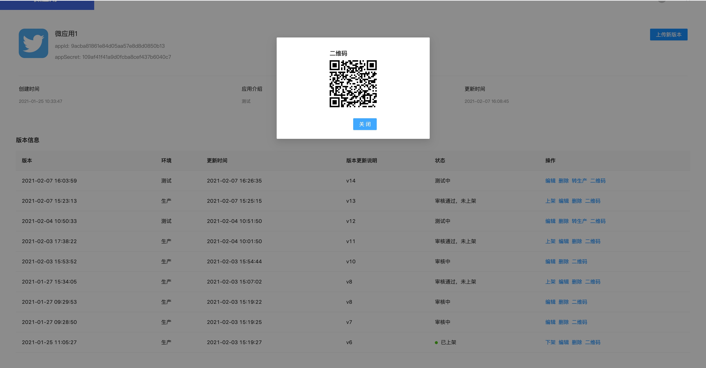
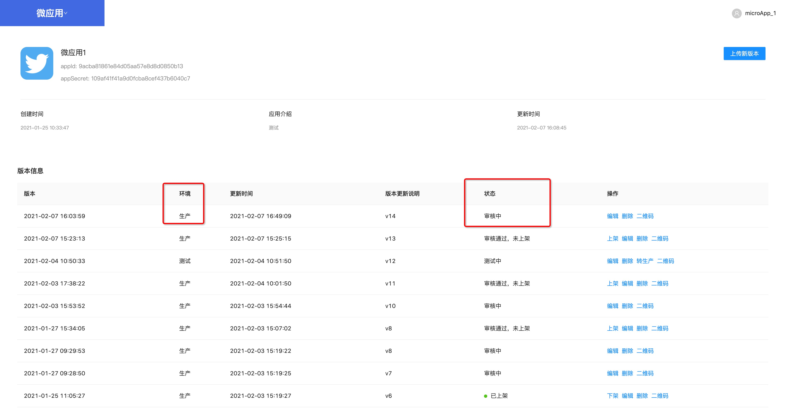
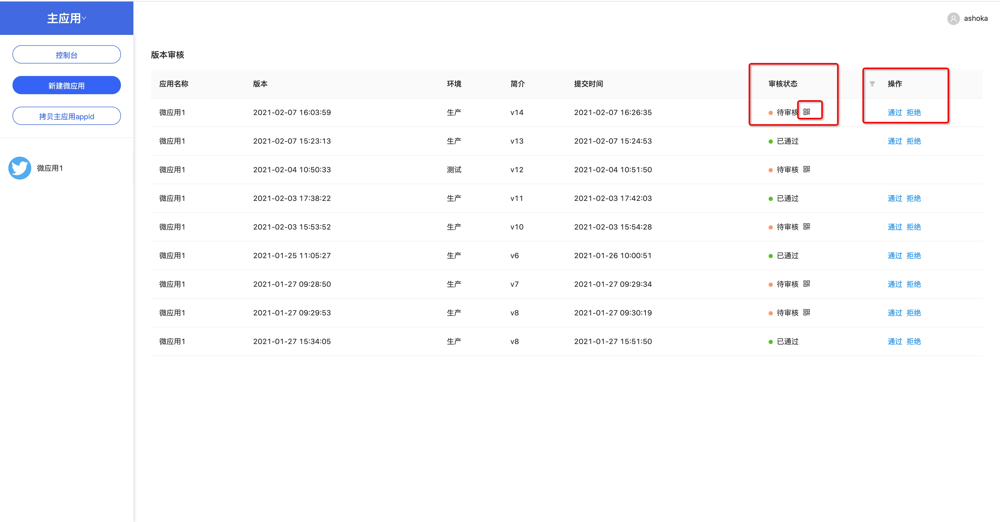
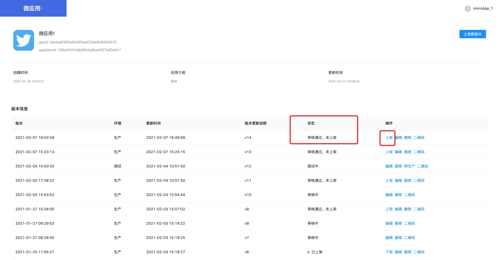

# 版本管理

## 上传新版本

使用微应用账号登录，上传新版本。上传的版本默认是在测试环境

## 自测

上传后，微应用状态是测试中。

点击二维码，然后用集成了微应用原生sdk的app调用调试页面扫码测试

测试通过后，点转生产，这时就提交到主应用账号进行审核，版本状态变成审核中

## 主应用账号审核微应用

使用主应用账号登录，在控制台可以看到待审核的微应用列表

点击二维码，使用集成有微应用原生sdk的app，打开调试页面扫码测试。测试通过，则点通过；测试不通过，点拒绝。

## 上架

当微应用审核通过后，就可以上架，点操作上架就行。上架后，就正式更新到生产环境。

