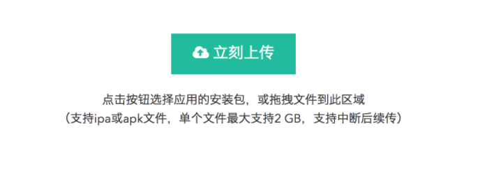
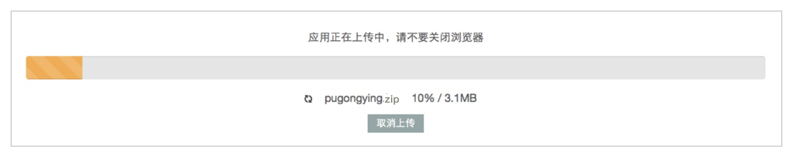
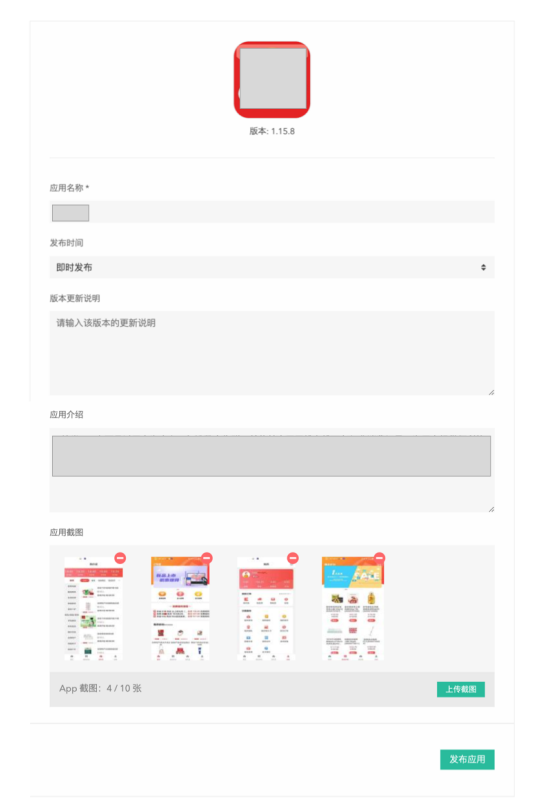
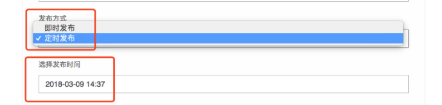

# 新建应用

## 应用上传

在首页右上角或者导航栏上，点击[发布应用]，进入发布应用页，如图所示：

可以点击图中的「立刻上传」按钮直接上传应用的安装包，或拖拽文件到虚线区域直接上传应用文件，按提示完成发布应用。

## 应用信息设置

上传完成后，可以进入设置应用信息的页面，在这个页面中，可以对应用进行一些基本信息的设置。

系统会自动识别包中的项目名称、版本号、Bundle Identifier、Icon 等基础信息。

需要手动编辑发布方式（如果是定时发布，需要选择发布时间）和选择性的提交版本更新说明。

可以编辑附加信息，项目简介和截图。（这两个信息会在之后的上传编辑时被复用）

## 如何定时发布应用

在设置应用信息页面，选择发布方式为定时发布，并设置发布时间。在未发布之前，可以在后续的修改页面修改。

